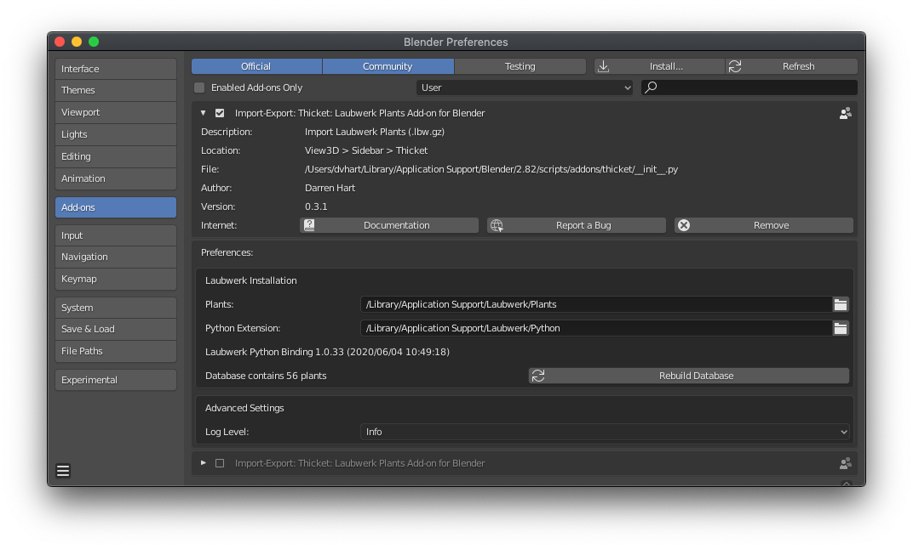
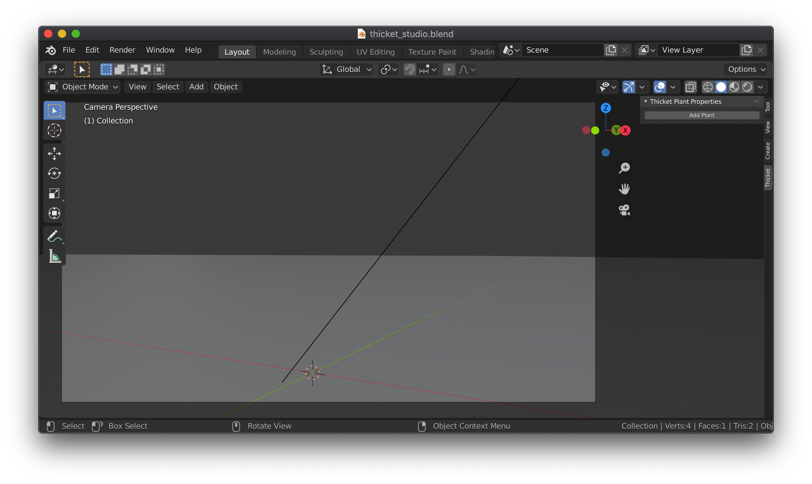
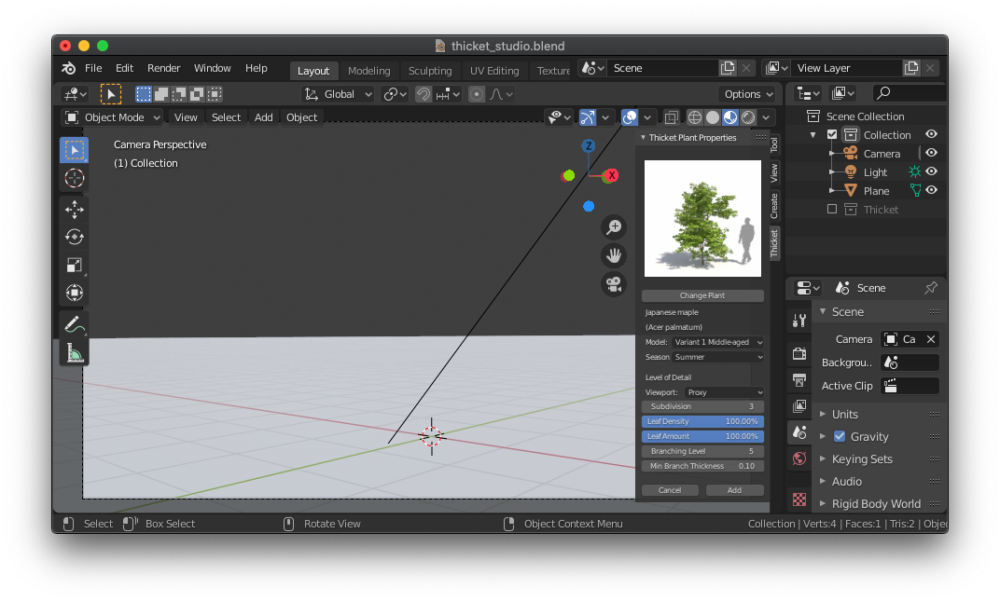
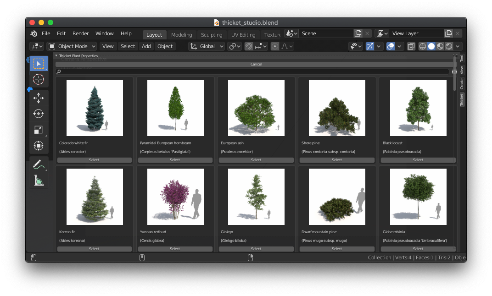
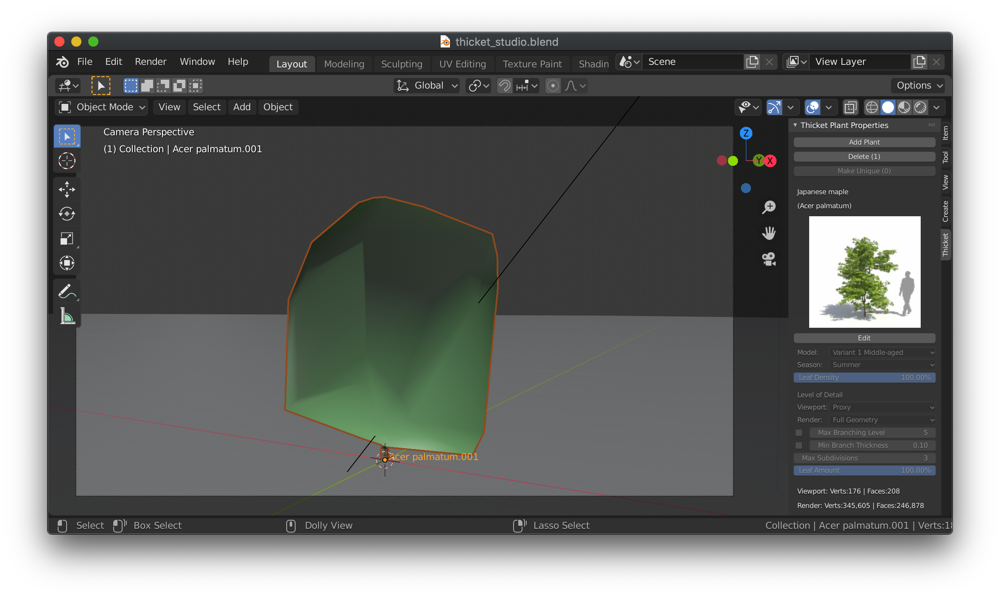
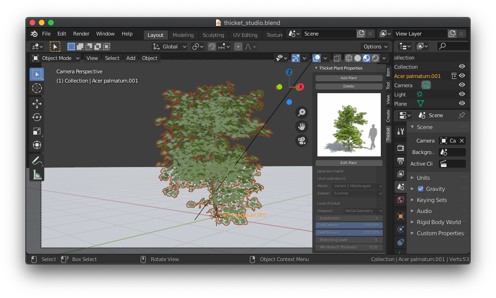
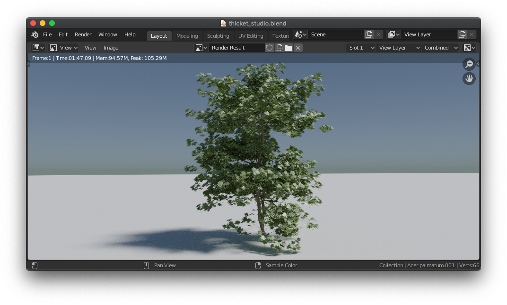
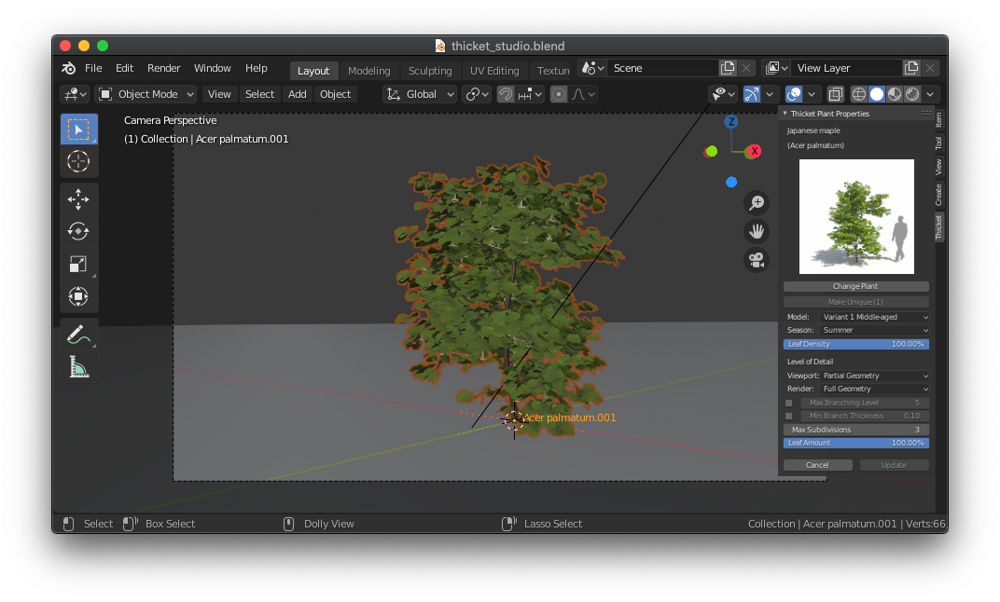
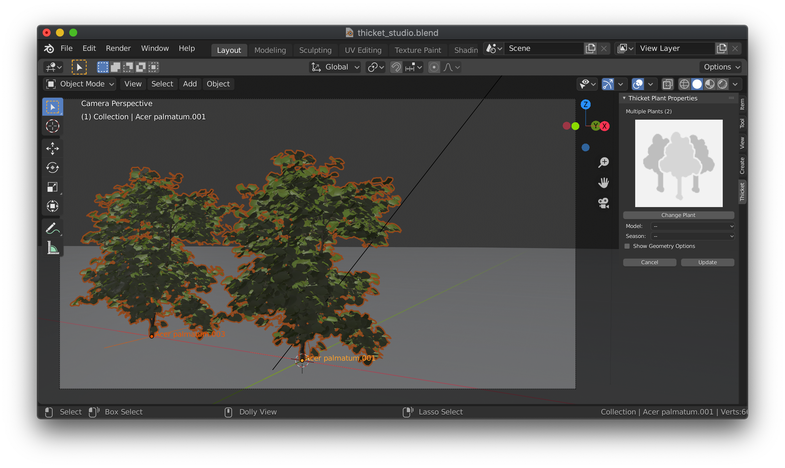
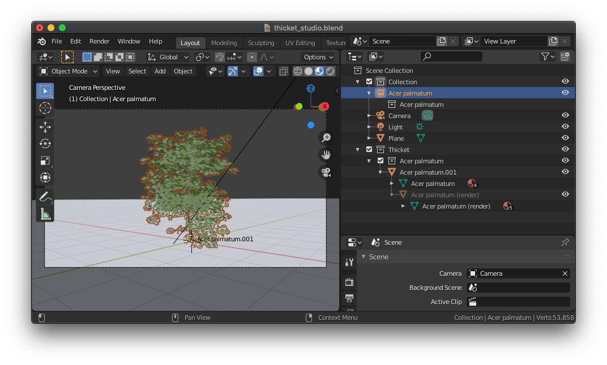

# Thicket (Archived)

Due to changes in the Laubwerk API and the lack of current API documentation, I am no longer able to develop or maintain Thicket. Consider trying Laubwerk’s fork of thicket:

[Laubwerk Player for Blender](https://github.com/Laubwerk/player-for-blender)

Thank you for using Thicket, it was a lot of fun to develop.

## Laubwerk Plants Add-on for Blender
Thicket is a [Blender](http://www.blender.org) Add-on to import [Laubwerk Plants](http://www.laubwerk.com) high resolution plant and tree models.

Thicket is an open source community developed project using the Laubwerk Python SDK. While not affiliated with or officially supported by Laubwerk GmbH, this project would not be possible without Laubwerk's efforts to answer questions and address issues during the development of Thicket.

Using Laubwerk's level of detail controls, Thicket keeps the Blender viewport responsive and renderings photo-realistic. Cycles render of a Japanese Maple (Acer Palmatum):

## Features
Thicket provides a visual plant selection gallery and options to configure the plant model variant, age, and leaf density. It generates separate viewport and render models, supporting various levels of detail for each. The viewport can display a low poly proxy (convex hull), partial or full geometry models in any of Blender's viewport modes. The rendered model geometry is generated using various level of detail controls.

* Sidebar "N Panel" UI
  * Visual plant selection gallery
  * Update existing plants
  * Update all identical instances at once
  * Batch update selected plants
  * Make instances unique
  * Smart delete to manage scene size
* Plant model options
* Separate viewport and render models
* Render level of detail controls
* Material nodes
* Collection instancing

## Install
* Download and install the prerequisites
  * [Blender](http://www.blender.org/) 2.80 ~~or later~~ through 3.0.1. Laubwerk 1.0.43 supports up to Python 3.9, Blender 3.1 switched to Python 3.10. Until Laubwerk adds Python 3.10 support, Blender 3.0.1 is the latest version Thicket can support.
  * Laubwerk Python SDK 1.0.33 or later, provided by all Laubwerk Plant Kits, including the [Plants Kit Freebie](http://www.laubwerk.com/store/plants-kit-freebie).
    * Choose the "Custom" installation method and ensure the "Python Extension" component is checked.
* Installation options
  * From a release Zip file (most users)
    * Download the latest release zip file from the [Releases Tab](/../../releases/)
    * Start Blender
    * Choose `Edit -> Preferences -> Add-ons -> Install`
    * Select the zip file and click `Install Add-on`
  * Latest from GitHub (for testers and developers)
    * Exit Blender
    * Clone the `thicket` git repository into the Blender `addons` folder:
      * Mac: `~/Library/Blender/2.80/scripts/addons/thicket`
      * Windows: `%AppData%\Blender Foundation\Blender\2.80\scripts\addons\thicket`
    * Start Blender
* Configure Thicket
  * Choose `Edit -> Preferences...`
  * Select the `Add-ons` tab and search for `thicket`
  * Check the box to enable the row `Import-Export: Thicket: Laubwerk Plants Add-on for Blender`
    * If you have more than one version installed, be sure to only enable one at a time
  * Click the arrow to expand the add-on preferences
  * Enter the Laubwerk Plants and Python Extension installation paths (these will be pre-populated with the platform defaults). The boxes will be red until valid paths are entered, then the Laubwerk SDK version will be displayed below.
  * Click `Rebuild Database`. This will take a few minutes depending on your computer and the number of Laubwerk Plants Kits installed.
  * When it completes, the number of plants in the database is displayed
* Thicket is now ready to use (see Usage)

## Usage
### N Panel
Thicket adds a Blender N Panel to Add, Edit, and Delete plants. Access the panel by pressing `n` and clicking on the `Thicket` tab.

### Add Plant
To add a plant, click `Add Plant`. Tthe panel presents a plant model, season, leaf density, and level of detail options.

Toa select a different plant from the gallery, press `Change Plant`. You can resize the panel to show up to 5 columns of plants. You can filter the results by entering a search term (clear the search by pressing the cancel icon to the right of the search field).

<image align="right" src="doc/thicket-panel-add-zoom.png">

The image preview will update when you change the `Model` variant and age. You can also configure the `Season`, `Leaf Density`, and several `Level of Detail` properties:

### Plant Model
**Model:** Select variant and age 
**Season:** Affect foliage, color, and flowers 
**Leaf Density:** Control how full the foliage appears 

### Level of Detail
**Viewport:** Control the model displayed in the viewport
* Proxy: low poly proxy (convex hull)
* Partial Geometry: low detail version of the render model
* Full Geometry: high detail render model

**Render:** Control the rendered model
* Proxy: low poly proxy (convex hull, forces viewport to Proxy)
* Full Geometry: high detail render model

**Max Branching Level:** Limit the number of branching levels off the trunk (uncheck to use the plant default) 
**Min Branch Thickness:** Eliminate branches smaller than this value (uncheck to use the plant default) 
**Max Subdivisions:** Control the max number of edges in a branch cross-section (1 is square) 
**Leaf Amount:** Control the number of leaves used to reach the specified leaf density (fewer leaves result in larger individual leaves) 

You can return to the gallery to select a different plant with `Change Plant`, add the current plant with `Add`, or cancel the operation with `Cancel`.
  

Adding Acer Palmatum with Viewport `Proxy` selected, loads the convex hull into the viewport:

Importing the same plant with Viewport `Partial Geometry` selected loads a low detail
version of the render model into the viewport:

The rendered model is the same for each, resulting in the following rendered image:

### Edit Plant
To edit the properties after a plant is added, select the plant in the viewport and press `Edit` under the thumbnail in the panel. Here, you can change the plant and any of the options. Pressing `Update` will replace the selected plant's template, changing all plants using the same template.

Batch updates are supported by selected multiple plants. In this mode, you can specify some new properties, and leave some unchanged. For example, you can select two different plant models, and change only the season. All options affecting geometry are changed as a group, made available by checking `Show Geometry Options`.

### Delete Plants
Avoid using `x` to delete plants. Instead, select the plants and press `Delete (#)` in the panel, where # indicates the number of plants selected. This will remove the plant instances from the viewport as well as the template plants when the last instance is removed. This will help keep your Blender file as small as possible.

### Make Plants Unique
To edit plants independently from others based on the same template, select the plants you want to be unique and press `Make Unique (#)`. The number of "sibling" plants (plants with the same template) is indicated by `(#)` in the `Make Unique (#)` label. If multiple plants are selected, each one will be made unique from the rest.

## Collections and Instancing
Thicket creates a template for each plant added, and places them in a top level collection named "Thicket" which is excluded from the View Layer by default. Each template is a collection consisting of the viewport object and the render object as a child of the viewport object. Object visibility settings determine which object is visible in the viewport, and which is visible for rendering. At import time, a Collection Instance of the template collection is added to the main scene collection. This is the object that is visible after import.

The object model is shown in the image below by checking the Thicket collection and expanding the template collection and object hierarchy:

The collection instance can be duplicated with `Shift+D` to add a second identical plant instance to the scene, without doubling the memory used. Because Collection Instances are displayed in the viewport, modifying the template in the Thicket collection will be reflected in all the instances (this is what Editing and Updating a plant with the Thicket N Panel does).

In short, leave the Thicket collection unchecked and duplicate the Collection Instance in the scene to make memory efficient copies of plants you can update in groups. To make a plant unique, select it and press `Make Unique (#)`.

## Report an Issue
Thicket is an open source project that is not affiliated with Laubwerk GmbH. If you think you have found a problem or a bug with Thicket, please [Check Existing Issues](/../../issues) to see if someone has already reported it. If not, please [Create a New Issue](/../../issues/new/choose), providing as much detail as possible to help us recreate the problem. Please do not contact Laubwerk directly.

## Contributing ##
See [CONTRIBUTING](CONTRIBUTING.md) for more information.
